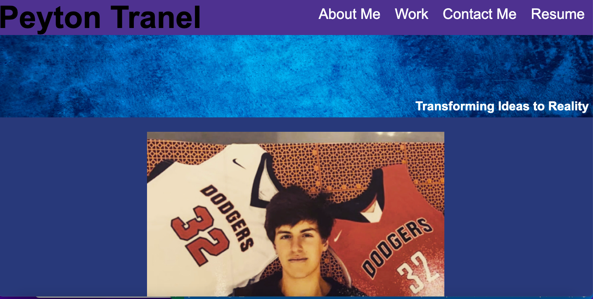

# My-Portfolio

## Description
My motivation for this project was to become a better web developer by creating a web application that was created from scratch. I built this project to create a job portfolio that I would use for my job search after the University of Wisconsin-Madison coding bootcamp, and to practice vital skills used in the develping world such as responsive design. This project solves the problem of web development companies wanting to reach out to me for a job. By including information about me, a section that shows off the work I am most proud of, and my contact information, employers can see if I am the right candidate for their position and also contact me as they see fit. This project taught me many things such as how to build HTML structure from scratch, add specific styling to a webpage based on the acceptance criteria, and how to create a web page with responsive design.

## Installation
To install this application go to the url "https://pjt3232.github.io/My-Portfolio/" on the browser of your choice.

## Usage
To use this application, go to the url "https://pjt3232.github.io/My-Portfolio/". The application should look like the screenshot below:

Once your at the deployed application, you can use the navigation links in the header to go to a specific section of the webpage (please note the resume section has not been added yet). There is a section with information about me, my work, and my contact information. By clicking on any of the images found in the work section, it will take you to a deployed application of my work from the University of Wisconsin-Madison bootcamp. By clicking on any of the respective links in the "Contact Me" section, you will be able to send me a message by phone, email, or GitHub.

## Credits
I used no third party and did not have any collaborators, but one of the images is taken from another site. The link to the image and the creator of the image is found below:

<a href="https://www.freepik.com/free-photo/abstract-grunge-decorative-relief-navy-blue-stucco-wall-texture-wide-angle-rough-colored-background_11712554.htm#query=background&position=0&from_view=keyword&track=sph">Image by benzoix</a> on Freepik
